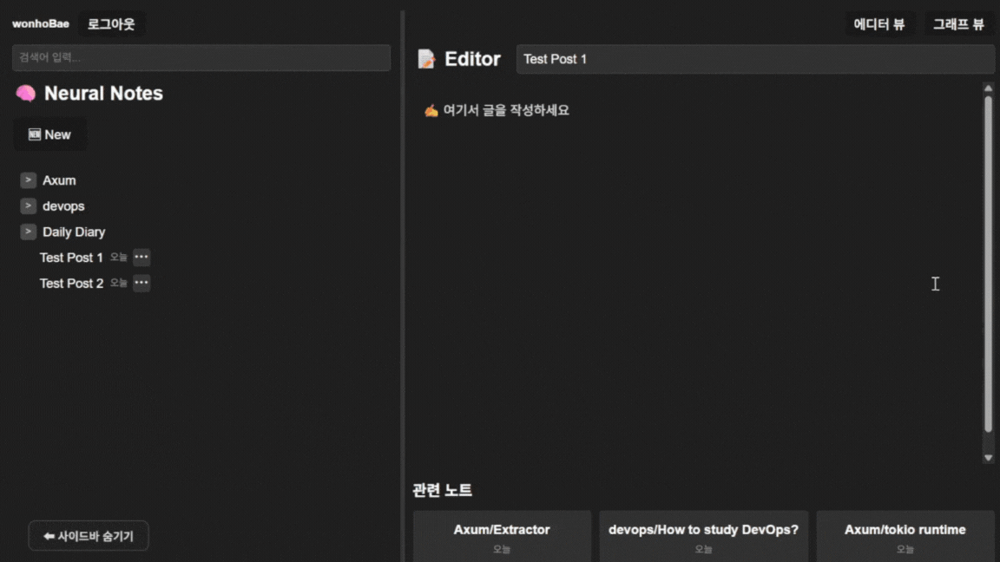
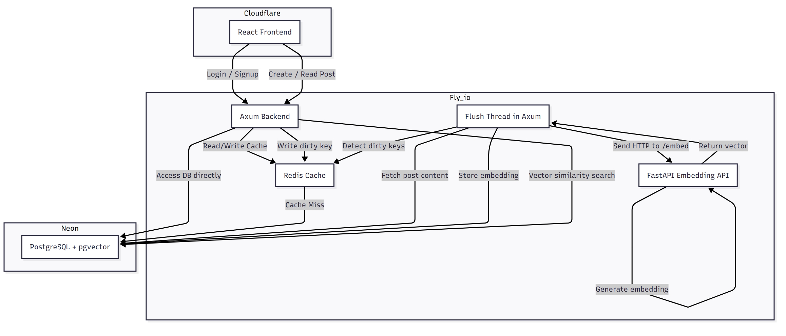

# NEURAL-NOTES
[](https://github.com/lyh4215/neural-notes/actions/workflows/ci_axum.yml)
[](https://neural-notes.pages.dev)

This is monorepo of `neural-notes` app.





## Structure


## Quick Start for dev
1. install just &  docker

2. in your shell
    ```bash
    git clone git@github.com:lyh4215/neural-notes.git
    cd neural-notes
    just env
    just dev
    ```
3. go to http://localhost:5173

## Backend - axum
- use [axum-redis-cache](https://github.com/lyh4215/axum-redis-cache)


## Frontend - react


## Embed api - FastAPI
- use embedding for *related post recommanding system*